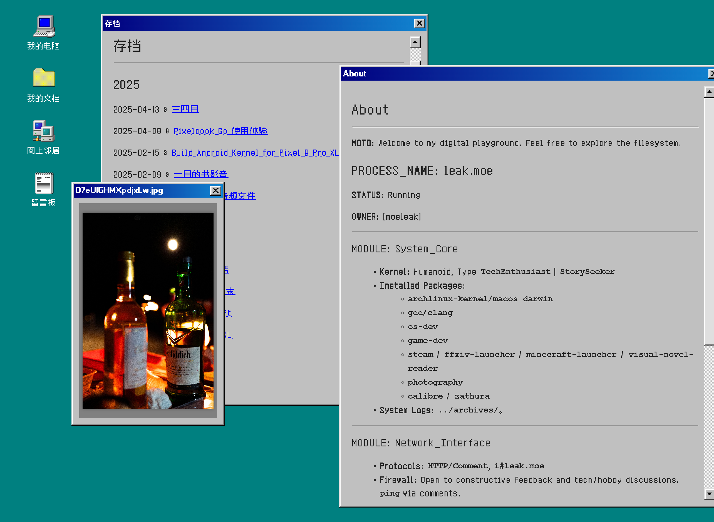

# A classic win98 style hexo theme.

## Web font

The theme uses [Zpix](https://github.com/SolidZORO/zpix-pixel-font) v3.1.11.
The site owner has permission from the copyright holder to convert and subset
the font for this website. During `hexo generate`, the site creates a shared
subset, an exact subset for each page, and small on-demand ranges for dynamic
text. Generated files are WOFF2 and content-hashed so browsers only fetch the
glyphs they need.

Zpix is designed around a 12px cell. The theme keeps its pixel edges crisp by
using integer font sizes and raises the previous 11/12/13px scale to
12/13/14px.
